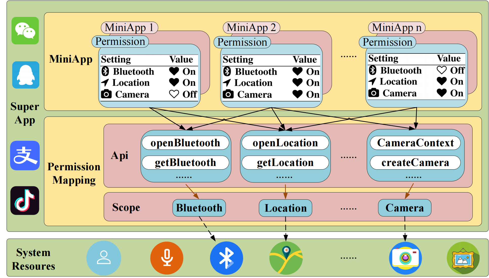
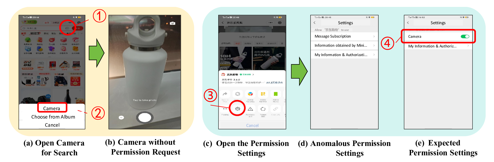
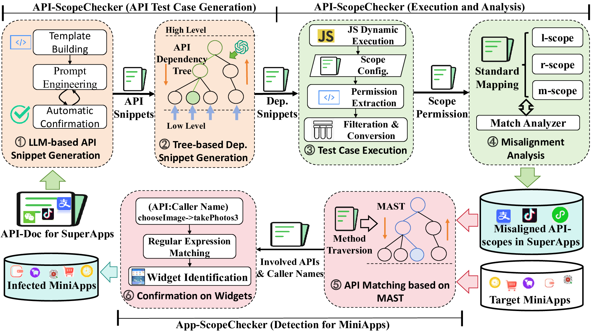

# Uncovering API-Scope Misalignment in the App-in-AppEcosystem

## Table of Contents
- [Abstract](#abstract)

- [API-Scope Misalignment in the App-in-App Ecosystem](#api-scope-misalignment-in-the-app-in-app-ecosystem)

  - [Background](#background)

  - [Motivating Examples](#motivating-examples)

- [ScopeChecker](#scopechecker)

  - [API-ScopeChecker](#api-scopechecker)
    - [Environment_1](#environment_1)
    - [Seamless Deployment_1](#seamless-deployment_1)
    - [Usage_1](#usage_1)
  - [APP-ScopeChecker](#app-scopechecker)
    - [Environment_2](#environment_2)
    - [Seamless Deployment_2](#seamless-deployment_2)
    - [Usage_2](#usage_2)
   
- [In The End](#in-the-end)
 
  - [Data](#data)
 
  - [Attack Video Demos](#attack-video-demos)
 
  - [Vendor Response](#vendor-response)

  - [Results](#results)

## Abstract

The "app-in-app" paradigm is an emerging trend in mobile system, where super applications (short for superApps) such as WeChat, Baidu, TikTok, enable external vendors to develop mini-programs (short for miniApps) on their platforms by providing privileged APIs. To facilitate management, superApps have devised their specific permission configuration (called scope) to grant the APIs access to specific capabilities and resources. Adhering to these scopes during API implementation is crucial for maintaining security; otherwise, the permission management of superApps can be bypassed, resulting in scope misalignment. 

In this work, we conduct the first systematic study on the scope misalignment issues in the app-in-app ecosystems, uncovering their root causes and security risks. More importantly, we have developed an automatic tool ScopeChecker with LLM-based test case generation to accurately detect the scope misalignment in both superApps and miniApps. The ScopeChecker successfully identified 38 misaligned APIs in 5 top superApps after careful manual confirmation, achieving an optimal detection accuracy compared to the state-of-the-art miniAppfocused test methods. 

As a highlight, we received 8 positive responses from the superApp developers and CNVD, encompassing 6 vulnerability confirmations with rewards: 1 high-risk (Baidu SRC: 1771863724718559232), 4 medium-risk (CNVD-2024-17003, CNVD-2024-15202 and 2 from Tencent SRC) and 1 low-risk (from TikTok SRC). To further explore the prevalence of scope misalignment in miniApps, the ScopeChecker is used to check over 42𝑘 realworld miniApps. The statistical verification result demonstrates that 51% of minApps have scope misalignment, with an average of 1.4 misaligned APIs per miniApp. Additionally, we illustrated 4 types of security threats raised by the scope misalignment by analyzing real-world exploitation cases. The materials of ScopeChecker are available at https://github.com/an-luckydog/ScopeChecker.

## API-Scope Misalignment in the App-in-App Ecosystem

### Background

To alleviate the challenges of traditional apps such as development complexity, cumbersome installation, and high resource consumption, mobile operating systems have developed a new app-in-app paradigm, which enables superApps to delegate specific functionalities and permissions to miniApps via providing APIs. These miniApps invoke the APIs of superApps to implement specific functionalities to meet the various requirements of users, such as social interactions, entertainment, travel and consumption. To enrich customized functionalities akin to native apps, the miniApps commonly integrate specialized web technologies like JavaScript, which empowers the miniApp to support cross-platform execution and installation-free usage. Once user installs a superApp, he/she gains the ability to engage with all the miniApps of that superApp. Such app-in-app paradigm allows superApps (e.g., WeChat, Facebook, TikTok) to build their own app ecosystems composed of miniApps, mirroring the profile of traditional app stores (Google Play, Apple Store). Notably, some top app-in-app ecosystems have gained remarkable user attraction, exceeding the scale of the traditional apps of mobile system.



Similar to the permission mechanism in Android apps, miniApps need to request permissions when accessing to sensitive data. Nevertheless, in the app-in-app paradigm, the permission management is delegated to the superApp rather than the mobile system. And the miniApps’ permission requests have two restrictions: The available permissions to be requested are limited by the permissions granted for the superApp; The permissions have to be requested through specific APIs provided by superApps. However, the superApps’ permissions for miniApps are not at the granularity of the APIs, as one sensitive resource may have different APIs. Instead, superApps defines multiple permission scopes, each of which corresponds to specific type of sensitive resource. The privileged APIs are mapped to the scopes based on their usage and the accessed resources. A scope may contain one API or multiple APIs, and once a scope is granted to an API, all the APIs in that category are granted with access to the correspondingly resources. The permission request is realized by dynamically popping-up prompts to guide user making the decision for granting access ("accept" or "reject"), similar to the approach used in the Android apps. The developers of miniApps can invoke the getSetting API to obtain the permission granting status, and invoke the openSetting API to open the setting page for permission granting. Users can view and adjust the permission granting status for any miniApp via the miniApp’s settings page (located under "About" − > "Settings").

### Motivating Examples

A representative instance of scope misalignment is illustrated in Fig. 1, depicting a permission request anomaly. The JD Shopping is a miniApp developed on top of the WeChat superApp. The JD miniApp provides a photo search feature (camera for search), indicated as the camera icon in Fig. 1(a)-① . When user clicks on the icon, a pop-up menu appears with two options: "Camera" and "Choose from album". If the user selects "Camera" (Fig. 1(a)-② ), the screen directly prompts to "Take Photo" (Fig. 1(b)) without requiring any permission to access the camera. 

When the user checks permission setting for the camera for search feature, by clicking on the settings button of the JD miniApp (Fig.1(c)-③ ), on the permissions settings page, there is no camera related permission (Fig.1(d)). Even when the permission setting is closed, the camera resources can still be accessed. As s contrast, in another miniApp ID Photo, when user accesses the camera feature, a camera permission request is prompted and the permission settings page appropriately includes a "Camera" setting (Fig. 1(e)). 

Such permission request anomalies within the app-in-app ecosystem can easily be exploited by attackers, leading to security threats and functionality issues, such as privilege escalation, privacy leaks, component failure, which motivates us to systematically study it.

## ScopeChecker

To comprehensively study the impact of the scope misalignment, we have developed an automatic detection framework ScopeChecker to investigate the problem from the perspective of both superApps and miniApps. The overall workflow of ScopeChecker is represented in Fig. 3, consisting of two modules: API-ScopeChecker which detects abnormal or missing API-scope mappings in superApps, and App-ScopeChecker which discovers problematic permission related APIs in the source code of miniApps.




### [API-ScopeChecker](https://github.com/an-luckydog/ScopeChecker/tree/master/ScopeChecker/API-ScopeChecker)

#### Environment_1

- Operating System: Windows 10/11.
- [IntelliJ IDEA Version](https://www.jetbrains.com/idea/download/?section=windows)：2023.3.6.
- [Wechatdevtools](https://developers.weixin.qq.com/miniprogram/dev/devtools/download.html)：Stable 1.06.2307260. other superApp ([QQ](https://q.qq.com/wiki/tools/devtool/),[Alipay](https://opendocs.alipay.com/mini/ide/overview),[Baidu](https://smartprogram.baidu.com/docs/introduction/tool/),[Tiktok](https://developer.open-douyin.com/docs/resource/zh-CN/developer/tools/ide))
- [Java Version](https://www.oracle.com/java/technologies/downloads/#java8-windows): Java 8.

#### Seamless Deployment_1

1. Backend: Start the GptServer file in IDEA  and add the following configuration to the /target/classes/application.yaml configuration file:
```bash
gpt:
  model:
    key: "your gpt key"
  proxy:
   host: 127.0.0.1
   port: 7890
```
Start Backend test.java.
2. Frontend：Start the MiniApp file in Wechatdevtools. Compile and run.

#### Usage_1

Enter the Applet API you wish to test (e.g., wx.chooseImage), then click 'Send'. The dialog box will promptly exhibit the test code generated by the comprehensive model. Should any discrepancies arise in the generated test code, kindly re-enter the API (e.g., wx.chooseImage), and the comprehensive model will promptly furnish the refined test code. Simply click 'Run', and the dialog box will autonomously execute the API's test code. For additional details, click 'Settings', where the scope information of the current API and the comparative analysis will be readily displayed.

### [APP-ScopeChecker](https://github.com/an-luckydog/ScopeChecker/tree/master/ScopeChecker/APP-ScopeChecker)

#### Environment_2

- Operating System: Windows 10/11
- [Python Version](https://www.python.org/downloads/): >= 3.6
- [Node.js Version](https://nodejs.cn/download/): >= 12.22.12
- [pycharm](https://www.jetbrains.com/pycharm/download/?section=windows#section=windows) ：2023.2

#### Seamless Deployment_2

1. Installing the Required Packages

Navigate to the APP directory and install the required packages using the following command:
```bash
pip install -r requirements.txt
```
We recommend using a virtual environment to install the required packages.

2. Preparing the Configuration File

Add the following configuration to the `config.json` file(The problem_apis parameter lists some of the problem api's, the full problem api's can be obtained from the Result documentation):
```json
{
  "input_applets_dir": "",
  "output_results_dir": "",
  "type": "wx",
  "problem_apis": [
    "chooseImage",
    "chooseVideo",
    "chooseMedia",
    "getClipboardData"
  ],
  "append": "true"
}
```
Where `input_applets_dir` is the directory where the WeChat applets are located.
It is usually located in the following path on Windows:
```
C:\\Users\\{UserName}\\Documents\\WeChat Files\\Applet
```
and
```
/Users/{UserName}/Library/Containers/com.tencent.xinWeChat/Data/.wxapplet/packages
```
on macOS.

`output_results_dir` is the directory where the results will be saved.

`append` is a boolean value that indicates whether the results should be appended to the file or not.

The `type` field is used to specify the type of the applets. It is mapped to the following values:

| Super app | Applet type |
| --------- | ----------- |
| Wechat    | wx          |
| Baidu     | swan        |
| QQ        | qq          |
| Alipay    | my          |

If `append` is set to `false`, the output `applet_info.csv` file will be overwritten.

#### Usage_2

You should have the `config.json` file ready before running the detection script and having the WeChat or other applets as it is in the `input_applets_dir` directory.

To test the detection script, run the following command:

```bash
python3 main.py
```

It will generate the `applet_info.csv` file in the `output_results_dir/report` directory.

Results for each applet will also be saved in the `output_results_dir/report` directory.

If errors occur, please check the files generated in the `output_results_dir` directory.

It should also include the `decrypted_code` files generated by the `pc_wxapkg_decrypt` tool.

The results of the APP-ScopeChecker detection script are saved in the `applet_info.csv` file in the `output_results_dir/report` directory.

## In The End

Specifically, this folder lists the various data generated in the project including the API's detection code, APP's detection results (source code, analysis results, etc.), and standards; the Attack Video Demos folder lists the Scope misalignment may result in at least four types of malicious exploitation and management threats; Vendor Response folder lists the various (high, medium, etc.) vulnerability proofs we obtained; Results folder lists the API-Scope Mapping, Standard Scope, Scope Misalignment APIs.

### [Data](https://github.com/an-luckydog/ScopeChecker/tree/master/Data)

**Data_MiniApp**: This folder contains the applet source files, source code, inspection results and other files of each platform generated by APP_ScopeChecker in the inspection process.

**Data_SuperApi**: This table lists the api execution samples generated during API_ScopeChecker execution, the actual Scope case, the standard Scope case, and the comparison results.

### [Attack Video Demos](https://github.com/an-luckydog/ScopeChecker/tree/master/Attack%20%20Video%20Demos)

Scope misalignment may result in at least four types of malicious exploitation and management threats, namely Permission Escalation (P-E), Phishing Attack (P-A), Privacy Leak (P-L) and Trust Crisis (T-C). We illustrate how these attacks occur through the following example cases. The detailed processes have been recorded into these videos. 

### [Vendor Response](https://github.com/an-luckydog/ScopeChecker/tree/master/Vendor%20Response)

To gain insights from the SuperApp developers, we reported the scope misalignment issues and some typical misaligned APIs (e.g., qq.chooseVideo(), wx.getClipboardData(), swan.getClipboardData()) to the corresponding superApp development teams, including Baidu/TikTok/Tencent Security Response Center (SRC), and WeChat Support Teams. To date, we have received 8 positive responses, including 6 vulnerability confirmations with rewards: 1 high-risk from Baidu SRC, 2 medium-risk from Tencent SRC, 2 medium-risk from CNVD (CNVD-2024-17003, CNVD-2024-15202) and 1 low-risk from TikTok SRC.

Specifically, Baidu SRC and Tencent SRC recognised the great importance of the scope misalignment issues, classifying them as high-risk and medium-risk vulnerabilities, respectively. Tencent SRC places them into their core business area with a threat score of 5 (the highest score among medium-risks) with a contribution value of 175 (the highest value among medium-risks). The responses from these superApp developers indicate a high level of acknowledgement of the scope misalignment issues, affirming the practical security value of our study results.

### [Results](https://github.com/an-luckydog/ScopeChecker/tree/master/Result)

**Scope**: The Wechat, QQ, Alipay, Tiktok, Baidu table lists the scope of each of the major mainstream super apps, the Scope General table lists the scope comparisons between them, and the Standard Scope table lists our standard scopes.

**API-Scope Mapping**: This table lists the mapping of super application api -> system api -> system permissions -> Scope.

**Scope Misalignment API**: This table lists the details of api's with Scope misalignment issues.

**Scope Misalignment APP**: This table lists the details of app's with Scope misalignment issues.

