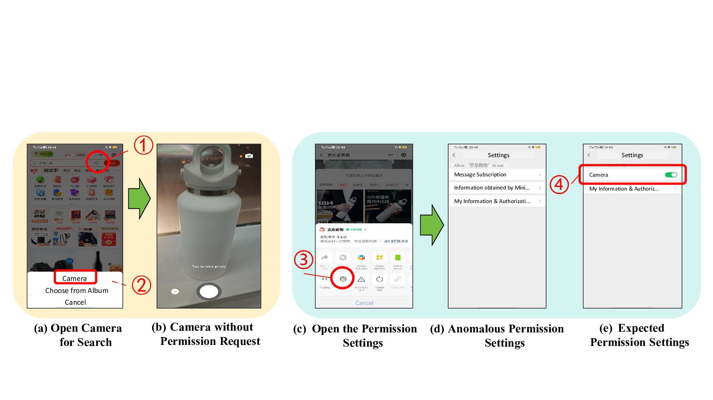

# Uncovering API-Scope Misalignment in the App-in-AppEcosystem

## Table of Contents
- [Abstract](#abstract)

- [API-Scope Misalignment in the App-in-App Ecosystem](#api-scope-misalignment-in-the-app-in-app-ecosystem)

  - [Background](#background)

  - [Motivating Examples](#motivating-examples)

- [ScopeChecker](#scopechecker)

  - [API-ScopeChecker](#api-scopechecker)
    - [Environment_1](#environment_1)
    - [Installation_1](#installation_1)
    - [Seamless Deployment_1](#seamless-deployment_1)
    - [Usage_1](#usage_1)
  - [APP-ScopeChecker](#app-scopechecker)
    - [Environment_2](#environment_2)
    - [Installation_2](#installation_2)
    - [Seamless Deployment_2](#seamless-deployment_2)
    - [Usage_2](#usage_2)
   
- [Result](#result)
 
  - [Data](#data)
 
  - [Attack Video Demos](#attack-video-demos)
 
  - [Vendor Response](#vendor-response)

## Abstract

The "app-in-app" paradigm is an emerging trend in mobile system, where super applications (short for superApps) such as WeChat, Baidu, TikTok, enable external vendors to develop mini-programs (short for miniApps) on their platforms by providing privileged APIs. To facilitate management, superApps have devised their specific permission configuration (called scope) to grant the APIs access to specific capabilities and resources. Adhering to these scopes during API implementation is crucial for maintaining security; otherwise, the permission management of superApps can be bypassed, resulting in scope misalignment. 

In this work, we conduct the first systematic study on the scope misalignment issues in the app-in-app ecosystems, uncovering their root causes and security risks. More importantly, we have developed an automatic tool ScopeChecker with LLM-based test case generation to accurately detect the scope misalignment in both superApps and miniApps. The ScopeChecker successfully identified 38 misaligned APIs in 5 top superApps after careful manual confirmation, achieving an optimal detection accuracy compared to the state-of-the-art miniAppfocused test methods. 

As a highlight, we received 8 positive responses from the superApp developers and CNVD, encompassing 6 vulnerability confirmations with rewards: 1 high-risk (Baidu SRC: 1771863724718559232), 4 medium-risk (CNVD-2024-17003, CNVD-2024-15202 and 2 from Tencent SRC) and 1 low-risk (from TikTok SRC). To further explore the prevalence of scope misalignment in miniApps, the ScopeChecker is used to check over 42𝑘 realworld miniApps. The statistical verification result demonstrates that 51% of minApps have scope misalignment, with an average of 1.4 misaligned APIs per miniApp. Additionally, we illustrated 4 types of security threats raised by the scope misalignment by analyzing real-world exploitation cases. The materials of ScopeChecker are available at https://github.com/an-luckydog/ScopeChecker.

## API-Scope Misalignment in the App-in-App Ecosystem

### Background

To alleviate the challenges of traditional apps such as development complexity, cumbersome installation, and high resource consumption, mobile operating systems have developed a new app-in-app paradigm, which enables superApps to delegate specific functionalities and permissions to miniApps via providing APIs. These miniApps invoke the APIs of superApps to implement specific functionalities to meet the various requirements of users, such as social interactions, entertainment, travel and consumption. To enrich customized functionalities akin to native apps, the miniApps commonly integrate specialized web technologies like JavaScript, which empowers the miniApp to support cross-platform execution and installation-free usage. Once user installs a superApp, he/she gains the ability to engage with all the miniApps of that superApp. Such app-in-app paradigm allows superApps (e.g., WeChat, Facebook, TikTok) to build their own app ecosystems composed of miniApps, mirroring the profile of traditional app stores (Google Play, Apple Store). Notably, some top app-in-app ecosystems have gained remarkable user attraction, exceeding the scale of the traditional apps of mobile system.

Similar to the permission mechanism in Android apps, miniApps need to request permissions when accessing to sensitive data. Nevertheless, in the app-in-app paradigm, the permission management is delegated to the superApp rather than the mobile system. And the miniApps’ permission requests have two restrictions: The available permissions to be requested are limited by the permissions granted for the superApp; The permissions have to be requested through specific APIs provided by superApps. However, the superApps’ permissions for miniApps are not at the granularity of the APIs, as one sensitive resource may have different APIs. Instead, superApps defines multiple permission scopes, each of which corresponds to specific type of sensitive resource. The privileged APIs are mapped to the scopes based on their usage and the accessed resources. A scope may contain one API or multiple APIs, and once a scope is granted to an API, all the APIs in that category are granted with access to the correspondingly resources. The permission request is realized by dynamically popping-up prompts to guide user making the decision for granting access ("accept" or "reject"), similar to the approach used in the Android apps. The developers of miniApps can invoke the getSetting API to obtain the permission granting status, and invoke the openSetting API to open the setting page for permission granting. Users can view and adjust the permission granting status for any miniApp via the miniApp’s settings page (located under "About" − > "Settings").


### Motivating Examples

A representative instance of scope misalignment is illustrated in Fig. 1, depicting a permission request anomaly. The JD Shopping is a miniApp developed on top of the WeChat superApp. The JD miniApp provides a photo search feature (camera for search), indicated as the camera icon in Fig. 1(a)-① . When user clicks on the icon, a pop-up menu appears with two options: "Camera" and "Choose from album". If the user selects "Camera" (Fig. 1(a)-② ), the screen directly prompts to "Take Photo" (Fig. 1(b)) without requiring any permission to access the camera. 

When the user checks permission setting for the camera for search feature, by clicking on the settings button of the JD miniApp (Fig.1(c)-③ ), on the permissions settings page, there is no camera related permission (Fig.1(d)). Even when the permission setting is closed, the camera resources can still be accessed. As s contrast, in another miniApp ID Photo, when user accesses the camera feature, a camera permission request is prompted and the permission settings page appropriately includes a "Camera" setting (Fig. 1(e)). 

Such permission request anomalies within the app-in-app ecosystem can easily be exploited by attackers, leading to security threats and functionality issues, such as privilege escalation, privacy leaks, component failure, which motivates us to systematically study it.



## ScopeChecker

To comprehensively study the impact of the scope misalignment, we have developed an automatic detection framework ScopeChecker to investigate the problem from the perspective of both superApps and miniApps. The overall workflow of ScopeChecker is represented in Fig. 3, consisting of two modules: API-ScopeChecker which detects abnormal or missing API-scope mappings in superApps, and App-ScopeChecker which discovers problematic permission related APIs in the source code of miniApps.


### API-ScopeChecker

#### Environment_1

- Operating System: Windows 10/11
- IntelliJ IDEA Version：2023.3.6
- Wechatdevtools：Stable 1.06.2307260
- Java Version: Java 8

#### Installation_1

1. IntelliJ IDEA Version [here](https://www.jetbrains.com/idea/download/?section=windows).
2. Wechatdevtools [here](https://developers.weixin.qq.com/miniprogram/dev/devtools/download.html). other superApp ([QQ](https://q.qq.com/wiki/tools/devtool/),[Alipay](https://opendocs.alipay.com/mini/ide/overview),[Baidu](https://smartprogram.baidu.com/docs/introduction/tool/),[Tiktok](https://developer.open-douyin.com/docs/resource/zh-CN/developer/tools/ide))
3. Java Version：Java 8 [here](https://www.oracle.com/java/technologies/downloads/#java8-windows).

#### Seamless Deployment_1

#### Usage_1

### APP-ScopeChecker

#### Environment_2

We recommend using a virtual environment to install the required packages.

Start by cloning the PCDA_APP from GitHub using the following command:

git clone https://github.com/an-luckydog/ScopeChecker

#### Installation_2

#### Seamless Deployment_2

Add the following configuration to the `config.json` file:

```json
{
  "input_applets_dir": "",
  "output_results_dir": "",
  "type": "wx",
  "problem_apis": [
    "chooseImage",
    "chooseVideo",
    "chooseMedia",
    "getClipboardData"
  ],
  "append": "true"
}
```
Where `input_applets_dir` is the directory where the WeChat applets are located.

It is usually located in the following path on Windows:
```
C:\\Users\\{UserName}\\Documents\\WeChat Files\\Applet
```
and
```
/Users/{UserName}/Library/Containers/com.tencent.xinWeChat/Data/.wxapplet/packages
```
on macOS.

`output_results_dir` is the directory where the results will be saved.
`append` is a boolean value that indicates whether the results should be appended to the file or not.

The `type` field is used to specify the type of the applets. It is mapped to the following values:


| Super app | Applet type |
| --------- | ----------- |
| Wechat    | wx          |
| Baidu     | swan        |
| QQ        | qq          |


If `append` is set to `false`, the output `applet_info.csv` file will be overwritten.

#### Usage_2

Navigate to the PCDA_APP directory and install the required packages using the following command:

```bash
pip install -r requirements.txt
```

You should have the `config.json` file ready before running the PCDA detection script and having the WeChat or other applets as it is in the `input_applets_dir` directory.

To test the PCDA detection script, run the following command:

```bash
python3 main.py
```

It will generate the `applet_info.csv` file in the `output_results_dir/report` directory.

Results for each applet will also be saved in the `output_results_dir/report` directory.

If errors occur, please check the files generated in the `output_results_dir` directory.

It should also include the `decrypted_code` files generated by the `pc_wxapkg_decrypt` tool.


## Results

The results of the PCDA detection script are saved in the `applet_info.csv` file in the `output_results_dir/report` directory.

You can click [Here](./output_results_dir/report/applet_info.csv) to view the results we obtained.

### Data
### Attack Video Demos
### Vendor Response
